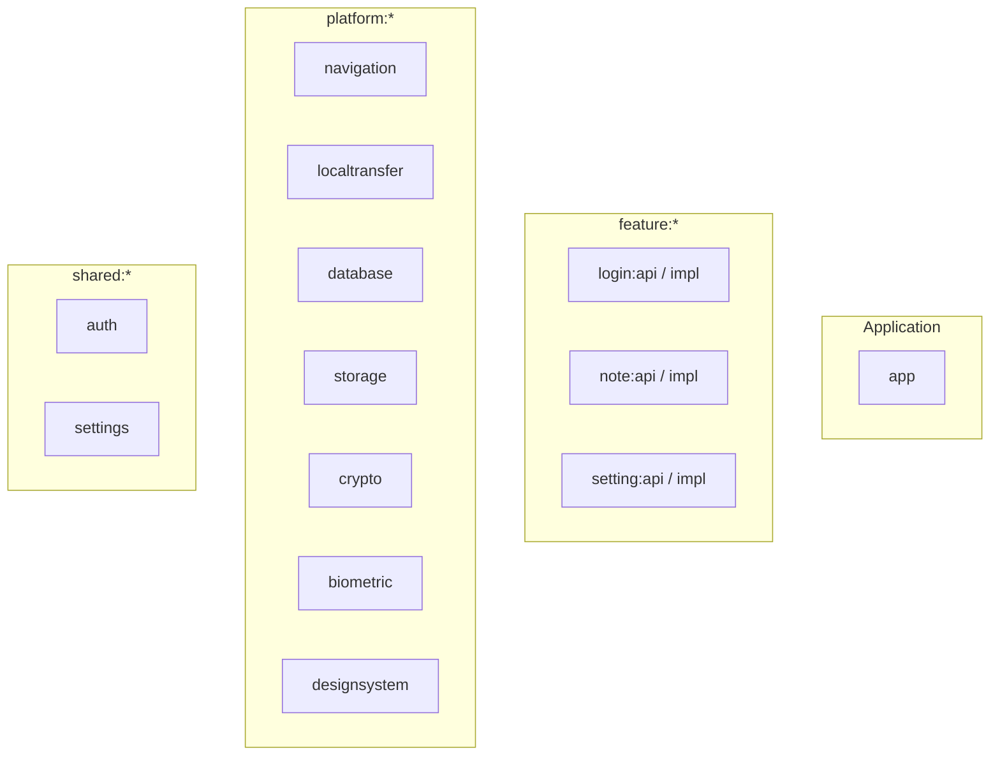
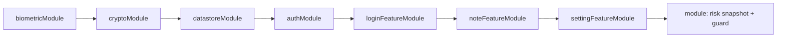
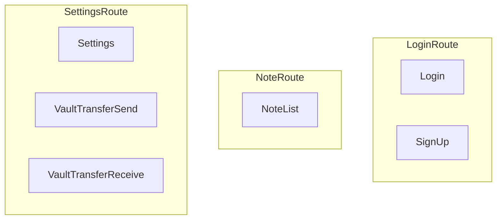
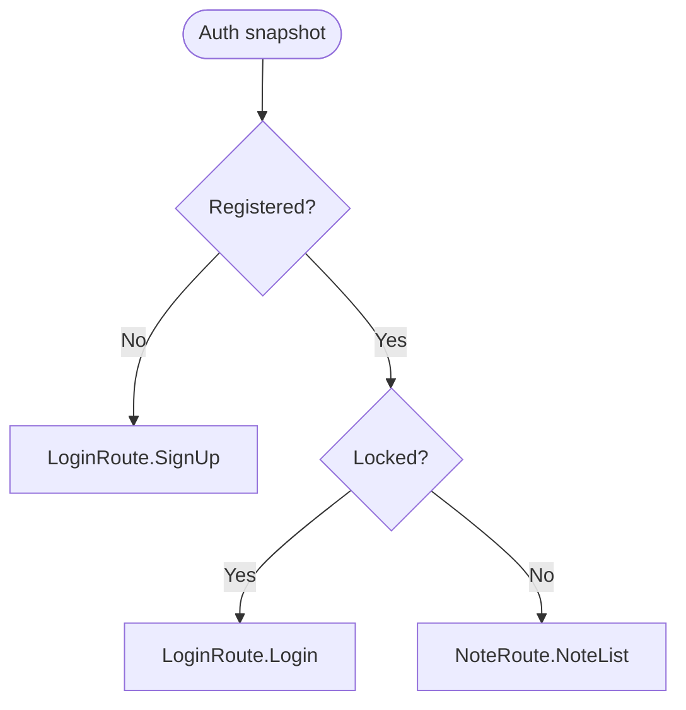
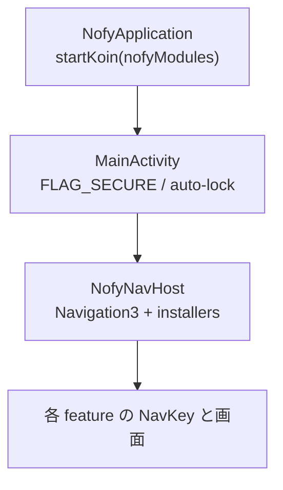

# Nofy アーキテクチャ俯瞰（Mermaid）

このページの図は **手動メンテ**です。モジュール追加・ナビ変更・Koin の並び替えなどをしたら、必要に応じてエージェントや人間が Mermaid を更新してください。詳細な約束事は `AGENTS.md` と `docs/tech.md` を参照。

---

## Gradle モジュール（論理グループ）

---

## 起動時 Koin（`NofyModules` の並び）

`module { … }` は危険環境検知と `SensitiveOperationGuard` の app 専用定義。

---

## 公開 NavKey（feature api の `data object`）

---

## 認証ゲート（初回ルート・強制置換の考え方）

`NofyNavHost` の `authGateRouteOrNull` と `resolveInitialRoute` に対応。

---

## ランタイムのざっくり束ね（単一 Activity）

