# Nofy マクロ可視化（Mermaid）

[README.md](../README.md) の見出し構成に沿って、**構造・振る舞い・信頼境界・データ**など複数次元を Mermaid で俯瞰します。図は **手動メンテ**です（リポジトリや挙動を変えたら更新してください）。

**§16–§34** は認証・ノート・設定・Vault 転送・生体・シェル・セキュリティパイプラインなど **プロダクトのメイン機能**をコード実装に寄せた図です。

---

## 1. Why Nofy — 文脈（システムの外枠）

ローカル優先・オフライン金庫。クラウド同期は前提にしない。Vault 転送のみ LAN。

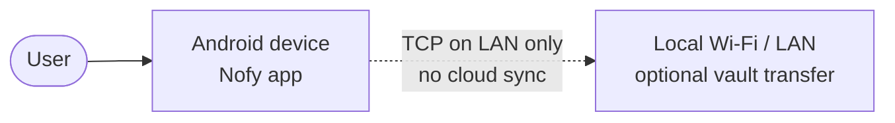

---

## 2. Repository layout — ディスクと Gradle の対応（マクロ）

README の表を関係として表現。

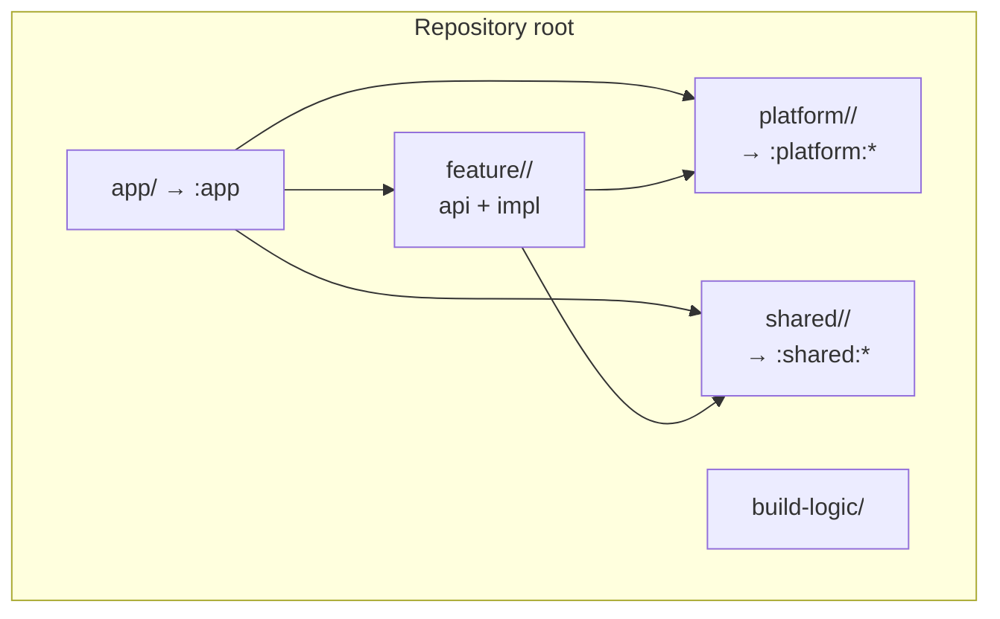

---

## 3. モジュール依存の向き（マクロ）

クリーンアーキテクチャの「内側へ向かう依存」のざっくり版（実線はよくある下向き依存）。

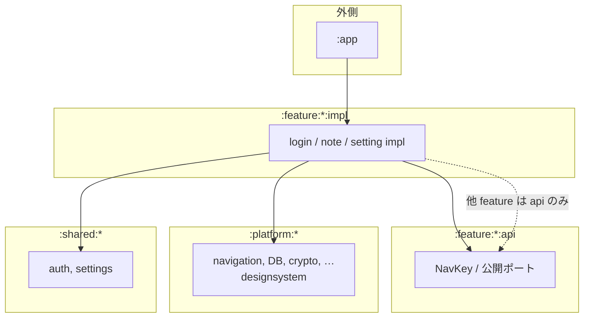

---

## 4. Tech stack — ランタイム技術の積み上げ（論理スタック）

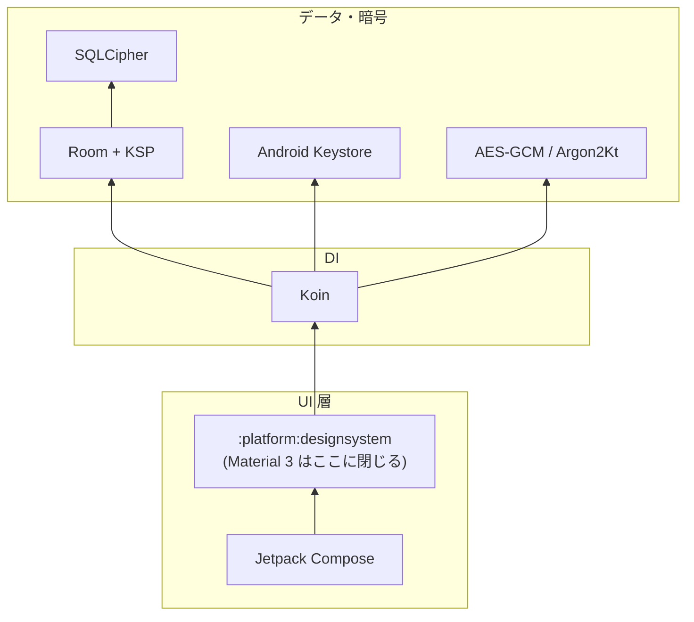

---

<a id="udf-arch"></a>

## 5. Architecture（short）— feature 内レイヤー + UDF

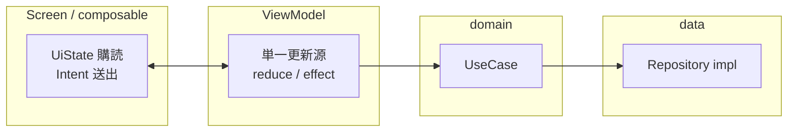

---

## 6. 起動〜DI〜ナビ（シーケンス）

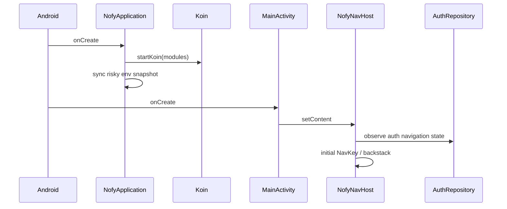

---

## 7. 認証ゲートとバックスタックの強制置換

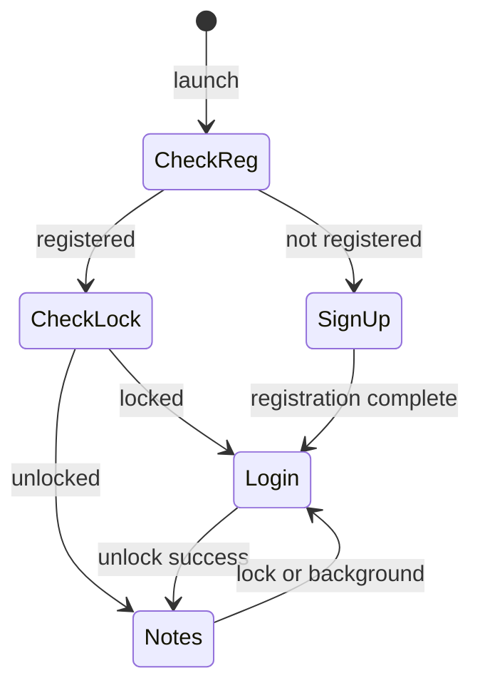

---

## 8. ユーザーフロー — 初回〜ノート到達（ハッピーパス）

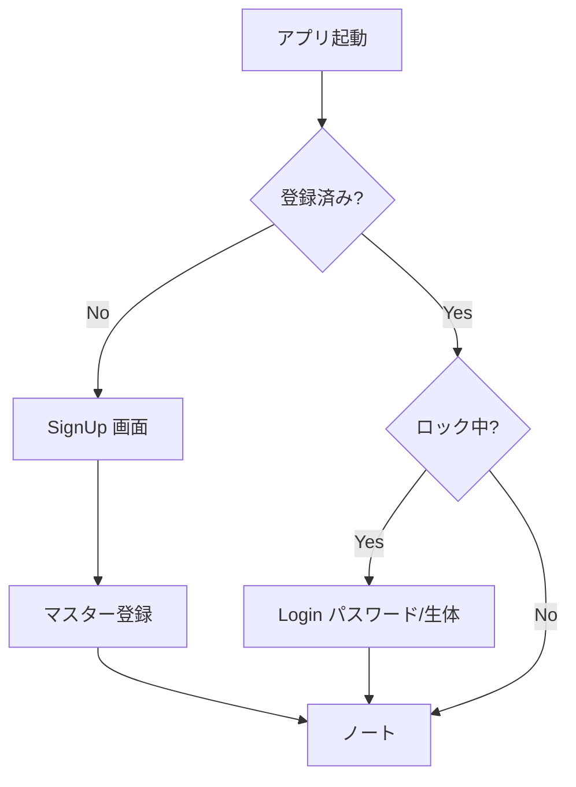

---

## 9. ユーザーフロー — ノート編集と遅延保存（概念）

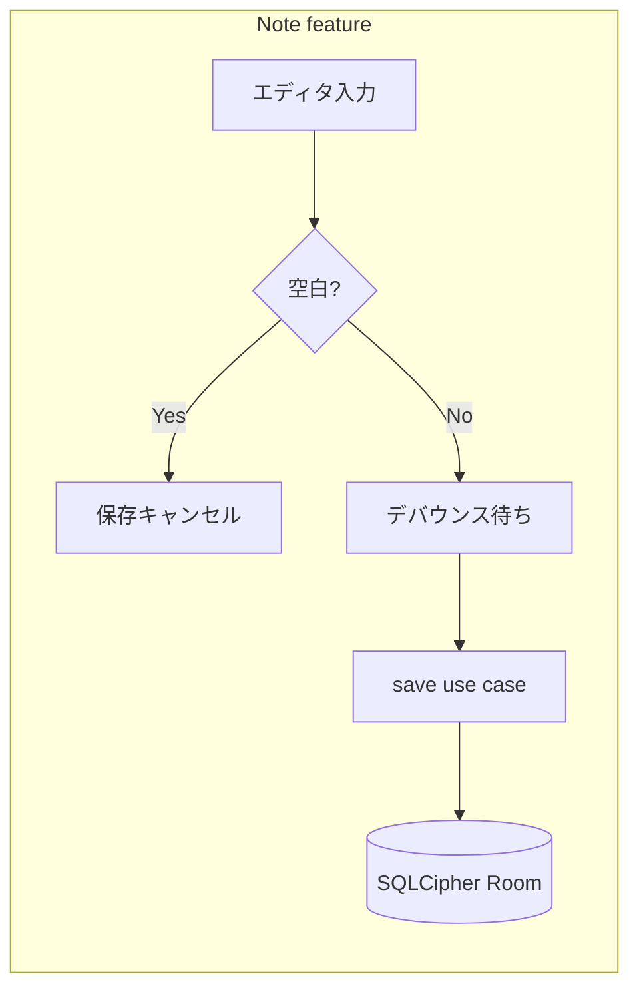

---

## 10. ユーザーフロー — 設定からロック・Vault 転送

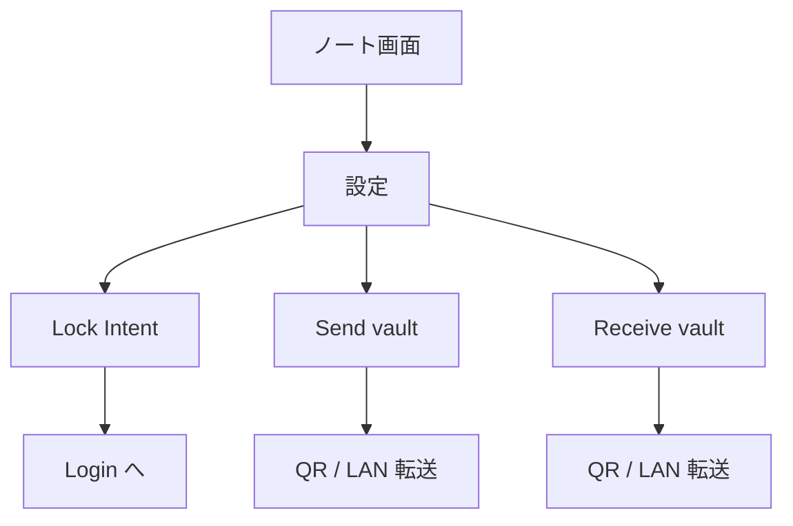

---

## 11. Security highlights — 信頼境界とブロック

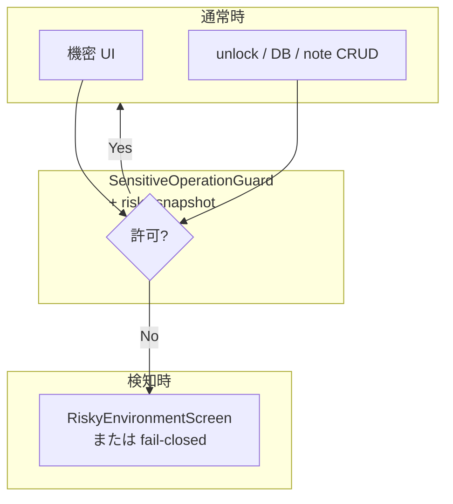

---

## 12. MainActivity — ライフサイクルと自動ロック（マクロ）

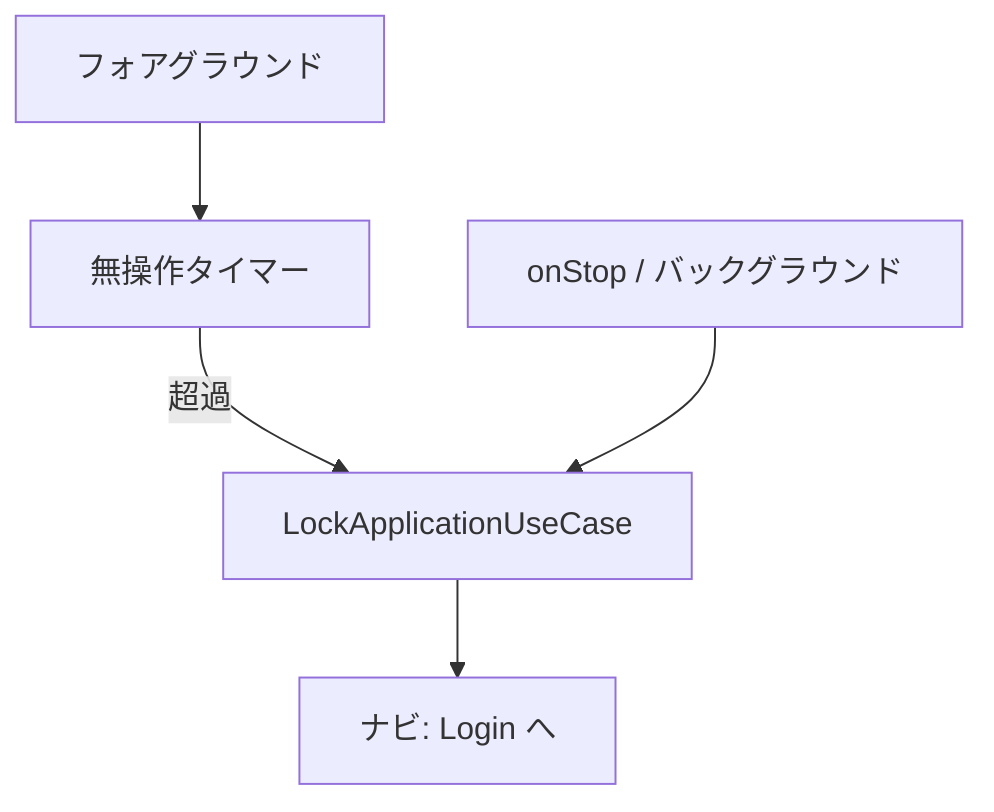

---

## 13. データと暗号（概念データフロー）

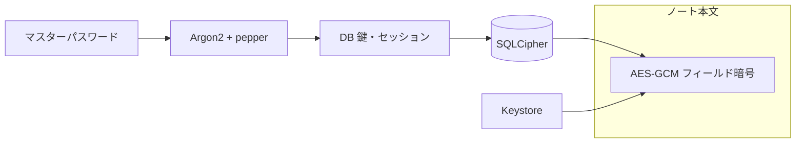

---

## 14. Contributing / 品質 — マクロ（CI・ボット）

README / Security に書かれている周辺。

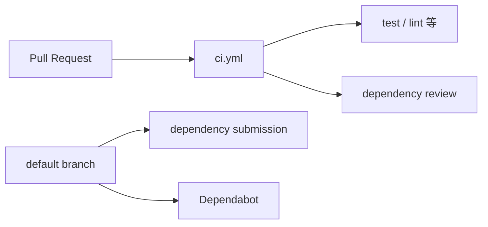

---

## 15. Documentation map — README が指すドキュメント

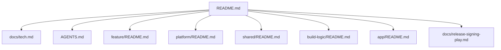

---

## 16. メイン機能 — 全 NavKey と画面遷移（実装に即したマップ）

`AppNavigator` の **`navigateTo` = スタックに積む**、`replaceWith` = **スタック全消しして 1 枚**（認証系はこちらが多い）。

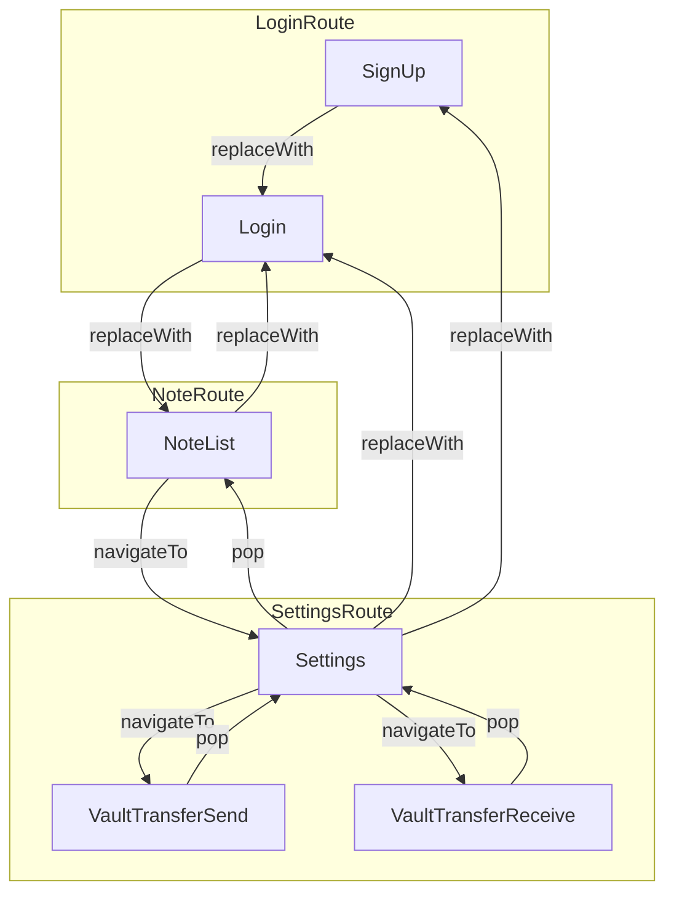

`NofyNavHost` は `AuthRepository` の **`isRegistered` × `isLocked`** を別途購読し、ゲート成立時は **`replaceWith(SignUp|Login)`** でバックスタックを上書きする（§7・§17 参照）。

---

## 17. 認証ドメイン — `AuthRepository` の責務と呼び出し文脈（マクロ）

`:shared:auth` の契約。メソッド群と **主な** 呼び出し元の対応（厳密な一対一ではない）。

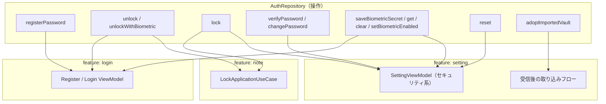

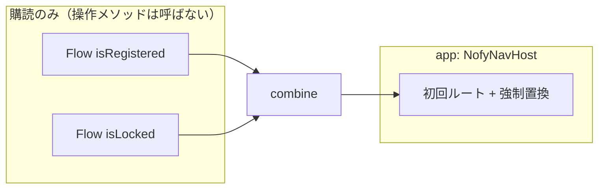

ナビ用スナップショットは `isRegistered()` と `isLocked()` の **Flow を `combine`**（`NofyNavHostAuthState`）。

---

## 18. メイン機能 — 新規登録（SignUp）フロー

マスターパスワード登録後、**必ず Login へ `replaceWith`**（その後ユーザーが再度解除してノートへ）。任意で **生体登録**（暗号化シークレット保存）。

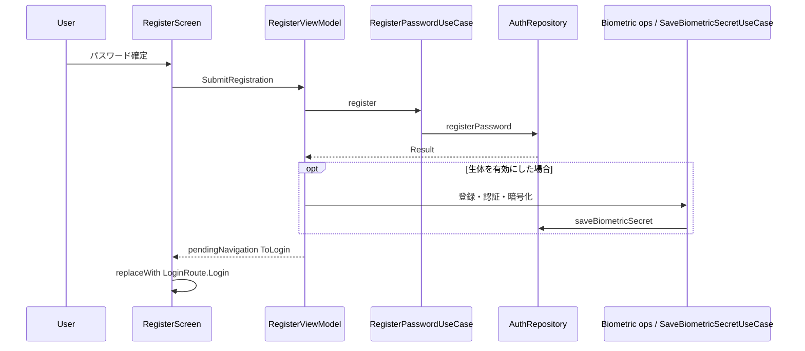

---

## 19. メイン機能 — ログイン（ロック解除）フロー

**パスワード**は `UnlockWithPasswordUseCase` → `unlock`。**生体**はシークレット復号準備 → `BiometricPrompt` → 平文パスワードで `unlockWithBiometric`。

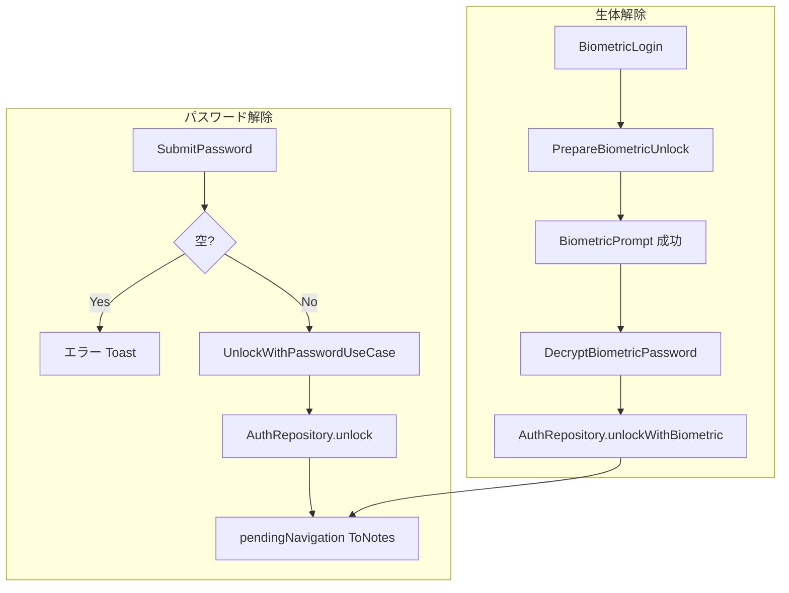

```mermaid
sequenceDiagram
  participant UI as LoginScreen
  participant VM as LoginViewModel
  participant UC as UnlockWithPasswordUseCase
  participant AR as AuthRepository
  UI->>VM: SubmitPassword
  VM->>UC: invoke
  UC->>AR: unlock(password)
  AR-->>VM: Result
  VM-->>UI: ToNotes → replaceWith NoteList
```

---

## 20. `NofyNavHost` — 認証スナップショットと強制 `replaceWith`

`LaunchedEffect` で **最新の登録／ロック**を見て、ゲートが要るルートならバックスタックを置換。

```mermaid
flowchart LR
  F1["Flow isRegistered"] --> C[combine]
  F2["Flow isLocked"] --> C
  C --> S["AuthNavigationState"]
  S --> L{LaunchedEffect}
  L --> R{resolveForcedRoute}
  R -->|null| OK[スタック維持]
  R -->|SignUp / Login| REP["backStack.replaceWith"]
```

---

## 21. メイン機能 — ノート（一覧・ページャ・編集）

単一画面 `NoteRoute.NoteList` 内で **複数ページ**（末尾ドラフト含む）。`NoteIntent` が VM への入口。

```mermaid
flowchart TB
  subgraph intents["NoteIntent（抜粋）"]
    I1["EditContent"]
    I2["PageChanged / Next / Prev"]
    I3["DeletePage"]
    I4["Reload / TogglePreview"]
    I5["Lock / NavigateToSettings"]
  end
  subgraph vm["NoteViewModel"]
    V1["ページ状態の更新"]
    V2["デバウンス保存ジョブ per pageId"]
    V3["LoadNotesSnapshot / SaveNote / DeleteNote"]
    V4["LockApplicationUseCase"]
  end
  intents --> vm
  V3 --> DB[("NoteRepository / SQLCipher Room")]
  V4 --> AUTH["AuthRepository.lock"]
```

**遅延保存**（実装値）: 入力後 **350ms** 待ち、同一 `pageId` の未実行ジョブはキャンセル。**本文が空**なら保存ジョブをキャンセルのみ（§9 との対応）。

```mermaid
sequenceDiagram
  participant UI as NoteScreen
  participant VM as NoteViewModel
  participant UC as SaveNoteUseCase
  UI->>VM: EditContent pageId content
  VM->>VM: 即時 UI 状態更新
  alt content が blank
    VM->>VM: cancelPendingSave
  else 非 blank
    VM->>VM: delay 350ms
    VM->>UC: saveNote
  end
```

---

## 22. メイン機能 — 設定（3 セクションと `SettingIntent`）

`SettingsSection`: **Appearance** / **Security** / **App**。画面から `AuthRepository` や設定ストアへ。

```mermaid
flowchart TB
  subgraph AP["Appearance"]
    A1["SelectThemeMode"]
    A2["ChangeFontScale"]
  end
  subgraph SC["Security"]
    S1["SavePassword → changePassword"]
    S2["DisableBiometric / Open…Enrollment…"]
    S3["ResetApp → reset"]
    S4["Lock → lock → ToLogin"]
  end
  subgraph AP2["App / ナビ"]
    N1["Vault Send / Receive screens"]
    N2["ToSignUp（データ消去後の導線等）"]
  end
```

```mermaid
flowchart LR
  ST[Settings ルート] --> V1[VaultTransferSend]
  ST --> V2[VaultTransferReceive]
  V1 --> ST
  V2 --> ST
```

---

## 23. メイン機能 — Vault LAN 転送（`LocalVaultTransfer` 概念）

**受信側**が TCP サーバと鍵材料を用意し、**QR** に IPv4・ポート・サーバ公開鍵を載せる。**送信側**が QR を読み取り、同一 LAN 上でソケット接続 → **ECDH で共有秘密 → AES-GCM でチャンク暗号**しファイルを転送。

```mermaid
sequenceDiagram
  participant RX as Receive 端末
  participant QR as QR ペイロード
  participant TX as Send 端末
  RX->>RX: ServerSocket + 鍵生成
  RX->>QR: host port serverPub
  TX->>TX: QR 解析
  TX->>RX: TCP 接続 + クライアント公開鍵
  RX->>TX: サーバ公開鍵確認
  Note over TX,RX: 共有鍵導出 → ストリーム AES-GCM
  TX->>RX: ボルトファイル暗号ストリーム
  RX->>RX: 復号してファイル書き込み
```

取り込み後は `AuthRepository.adoptImportedVault(password)` で **この端末向けに DB／セッションを開き直す**（§17）。

---

## 24. 生体ログイン — 「登録」と「解除」の経路

| 段階 | ざっくり場所 | 結果 |
|------|----------------|------|
| 初回登録時 | Register VM 内のオペレーション | `saveBiometricSecret` |
| 設定からオン | Setting の enrollment フロー | 同上 |
| ログイン画面 | `BiometricLogin` | 保存済みシークレットを **復号**して `unlockWithBiometric` |
| オフ | Setting `DisableBiometric` / Login 側のクリア系 | `clearBiometricSecret` / `setBiometricEnabled(false)` 等 |

```mermaid
flowchart LR
  subgraph enroll["シークレット保存（登録・設定）"]
    E1[ユーザー + BiometricPrompt] --> E2[マスターでラップした秘密を暗号化]
    E2 --> E3[AuthRepository.saveBiometricSecret]
  end
  subgraph unlock["ロック解除（ログイン）"]
    U1[BiometricPrompt] --> U2[Keystore で復号]
    U2 --> U3[平文マスターで unlockWithBiometric]
  end
```

---

## 25. メイン機能インデックス（能力 → ドキュメント節の対応）

プロダクトが提供する **ユーザー向け能力**と、このファイル内の図の対応（ざっくり）。

```mermaid
flowchart TB
  subgraph auth["認証・ロック"]
    A1[初回マスター登録]
    A2[パスワード / 生体で解除]
    A3[手動ロック・BG ロック]
    A4[ナビゲートゲート]
  end
  subgraph notes["ノート"]
    N1[複数ページ編集]
    N2[遅延保存・削除]
    N3[Markdown プレビュー]
  end
  subgraph cfg["設定"]
    C1[テーマ・フォント]
    C2[マスター変更・リセット]
    C3[生体のオンオフ]
  end
  subgraph vault["Vault LAN"]
    V1[パック送信]
    V2[受信・取り込み]
  end
  subgraph shell["アプリシェル"]
    S1[危険環境ブロック]
    S2[FLAG_SECURE 等]
  end
```

| 能力 | 主な図 |
|------|--------|
| 登録・ログイン・生体 | §7–§8, §17–§19, §24 |
| ナビ・ルート | §16, §20 |
| ノート編集・保存・削除・プレビュー | §9, §21, **§28** |
| 設定（見た目・セキュリティ） | §22, **§27** |
| Vault 転送 | §23, **§29** |
| 危険環境・ガード・自動ロック | §11–§12, **§26**, **§28**, **§31** |
| 暗号・DB（概念） | §13 |
| アプリ全体ロックの単一 UC | **§30** |
| 設定のドメイン操作（マスター変更・リセット・生体フラグ） | **§32** |
| ノートのドメイン操作（読み書き削除） | **§33** |
| 登録ポリシー・ログイン試行制限 | **§34** |

---

## 26. アプリシェル — `MainActivity` の表示分岐と自動ロック

単一 Activity。`RiskyEnvironment` が非 null のときは **ナビより先に** 全画面ブロック UI。それ以外は `NofyNavHost`。テーマは **`UiSettingsRepository.settings` を `NofyTheme` に流す**（§27）。

```mermaid
flowchart TD
  MC[MainActivity onCreate] --> FLG[FLAG_SECURE 等ウィンドウフラグ]
  MC --> OBS[ProcessLifecycle onStop]
  OBS --> LCK[LockApplicationUseCase]
  MC --> REF[refreshRiskyEnvironment / 監視]
  MC --> SC[setContent]
  SC --> SET[collect uiSettings]
  SET --> TH[NofyTheme]
  REF --> RISK{risky != null?}
  RISK -->|Yes| BLOCK[RiskyEnvironmentScreen]
  RISK -->|No| NAV[NofyNavHost]
  TH --> BLOCK
  TH --> NAV
  subgraph idle["無操作タイマー"]
    ID[idle 経過] --> LCK
  end
```

---

## 27. メイン機能 — 見た目（テーマ・フォント）のデータフロー

契約は `:shared:settings` の **`UiSettingsRepository`**。実装は `:platform:storage` の **`SecureUiSettingsRepository`**（Koin `DatastoreModule`）。**書き込み**は主に `SettingViewModel`、**全画面反映**は `MainActivity` が Flow を購読。

```mermaid
flowchart LR
  subgraph write["設定画面"]
    SI[SelectThemeMode / ChangeFontScale] --> SVM[SettingViewModel]
    SVM --> USW[UiSettingsRepository.set*]
  end
  subgraph store[":platform:storage"]
    USW --> SEC[SecureUiSettingsRepository]
  end
  subgraph read["アプリ全体"]
    SEC --> FLOW["Flow UiSettings"]
    FLOW --> MA[MainActivity collect]
    FLOW --> SVM2[SettingViewModel init combine]
    MA --> NT[NofyTheme]
  end
```

---

## 28. メイン機能 — ノート補足（プレビュー・削除・危険環境）

- **プレビュー**: `NoteIntent.TogglePreview` → `isPreviewEnabled` を反転（表示切替のみ、永続化は別途なしの想定で OK）。
- **削除**: `DeletePage` → 当該 `pageId` の保存ジョブ取消 → 状態から除去 → `DeleteNoteUseCase`（永続削除）。
- **危険環境**: リポジトリが `NoteRepositoryException.UntrustedEnvironment` を返すケースやガード失敗時、`NoteViewModel` が **`lockApplicationUseCase` + メモリ wipe + Toast**（§11 のガードと連動。ロック後は §20 で Login へ）。

```mermaid
stateDiagram-v2
  [*] --> Editing: NoteList
  Editing --> PreviewOn: TogglePreview
  PreviewOn --> Editing: TogglePreview
  Editing --> Deleting: DeletePage
  Deleting --> Editing: state updated
```

```mermaid
sequenceDiagram
  participant UI as NoteScreen
  participant VM as NoteViewModel
  participant DEL as DeleteNoteUseCase
  UI->>VM: DeletePage
  VM->>VM: cancelPendingSave
  VM->>VM: removePageFromState
  VM->>DEL: delete persisted note
```

```mermaid
flowchart TD
  ERR[Load/Save/Delete が UntrustedEnvironment] --> H[handleUntrustedEnvironment]
  H --> L[LockApplicationUseCase]
  H --> W[wipeInMemoryNotes]
  H --> T[Toast 表示]
  L --> NAV[isLocked → NavHost 強制 Login 系]
```

---

## 29. メイン機能 — Vault 送受信（画面ステート × `NoteVaultTransferPort`）

`NoteVaultTransferPort` の実装は **note feature**（`NoteVaultTransferPortImpl`）。送受 UI は **setting feature**。転送プロトコル自体は §23。

### 送信側（`VaultSendUiState`）

```mermaid
stateDiagram-v2
  [*] --> Idle
  Idle --> Exporting: beginExport password
  Exporting --> Scanning: exportPackedVaultFile OK
  Exporting --> Failed: error
  Scanning --> Sending: onQrDecoded
  Sending --> Done: sendToPeer OK
  Sending --> Failed: error
  Done --> Idle: 画面を戻す等
```

### 受信側（`VaultReceiveUiState`）

```mermaid
stateDiagram-v2
  [*] --> Starting
  Starting --> Listening: startSession QR 表示
  Listening --> AwaitingPassword: receiveOnce OK
  Listening --> Failed: timeout/IO
  AwaitingPassword --> Importing: importWithPassword
  Importing --> Done: importPackedVaultFile OK
  Importing --> Failed: error
  Done --> [*]: pop 戻り
```

### ポート実装の段階（エクスポート／インポート）

```mermaid
flowchart TB
  subgraph exp["exportPackedVaultFile"]
    E0[SensitiveOperationGuard] --> E1[verifyPassword]
    E1 --> E2[lock]
    E2 --> E3[フィールド暗号状態 + DB ファイルを pack]
    E3 --> E4[unlock 元パスワード]
  end
  subgraph imp["importPackedVaultFile"]
    I0[SensitiveOperationGuard] --> I1[lock]
    I1 --> I2[NoteDatabase.delete]
    I2 --> I3[unpack → 新 DB + cipher 状態]
    I3 --> I4[adoptImportedVault vaultPassword]
  end
```

---

## 30. メイン機能 — アプリロックの単一入口 `LockApplicationUseCase`

`AuthRepository.lock()` のラッパー。**複数箇所から同じセマンティクス**で呼ばれる（ロック後は `isLocked` Flow 経由で §20 が効く）。

```mermaid
flowchart TB
  UC[LockApplicationUseCase]
  UC --> AR[AuthRepository.lock]
  N[NoteViewModel Lock / untrusted]
  S[SettingViewModel Lock]
  M[MainActivity onStop]
  I[MainActivity idle タイマー]
  R[MainActivity 危険環境に遷移した直後]
  N --> UC
  S --> UC
  M --> UC
  I --> UC
  R --> UC
```

---

## 31. メイン機能 — 危険環境の検知・スナップショット・ガード（エンドツーエンド）

1. **起動直後**（`NofyApplication`）: `RiskyEnvironmentDetector.detect()` → `RiskyEnvironmentSnapshotHolder.publish`  
2. **フォアグラウンド中**（`MainActivity`）: `onResume` で再検知、**周期ポーリング**で `refreshRiskyEnvironment`  
3. **ガード**: `SnapshotSensitiveOperationGuard` がスナップショット非 null なら `SensitiveOperationBlockedException`（Vault 転送・ノート層が「信頼できない」と解釈する経路に繋がる）  
4. **リスク新規発生時**: アイドルタイマー取消 + **`LockApplicationUseCase`**（§30）

```mermaid
sequenceDiagram
  participant App as NofyApplication
  participant Det as RiskyEnvironmentDetector
  participant Hold as RiskyEnvironmentSnapshotHolder
  participant Main as MainActivity
  participant G as SnapshotSensitiveOperationGuard
  participant Port as NoteVaultTransferPort 等
  App->>Det: detect
  App->>Hold: publish
  Main->>Det: detect onResume / poll
  Main->>Hold: publish
  Main->>Main: UI risky vs NavHost
  Port->>G: ensureSensitiveOperationAllowed
  alt snapshot が危険
    G-->>Port: blocked
  end
```

---

## 32. メイン機能 — 設定のドメイン use case → `AuthRepository` / 設定ストア

`SettingViewModel` は UI からの `SettingIntent` を、専用 UC へ委譲する箇所が多い。

```mermaid
flowchart LR
  subgraph ucs["setting/domain/usecase"]
    CP[ChangeMasterPasswordUseCase]
    RS[ResetVaultAndUiSettingsUseCase]
    SB[SetBiometricLoginEnabledUseCase]
  end
  CP --> AR[AuthRepository.changePassword]
  RS --> AR2[AuthRepository.reset]
  RS --> UI[UiSettingsRepository.reset]
  SB --> AR3[AuthRepository.setBiometricEnabled]
```

**リセット**は認証メタ＋永続を消した後、**見た目等の UI 設定を既定へ**（`ResetVaultAndUiSettingsUseCase`）。

```mermaid
sequenceDiagram
  participant VM as SettingViewModel
  participant UC as ResetVaultAndUiSettingsUseCase
  participant AR as AuthRepository
  participant US as UiSettingsRepository
  VM->>UC: invoke currentPassword
  UC->>AR: reset
  AR-->>UC: OK
  UC->>US: reset
```

---

## 33. メイン機能 — ノートのドメイン use case（読み・書き・削除）

`NoteViewModel` が orchestrate。永続とフィールド暗号は `NoteRepository` 実装側（`:feature:note:impl` の data 層）。

```mermaid
flowchart TB
  VM[NoteViewModel]
  L[LoadNotesSnapshotUseCase]
  S[SaveNoteUseCase]
  D[DeleteNoteUseCase]
  VM --> L
  VM --> S
  VM --> D
  L --> NR[NoteRepository]
  S --> NR
  D --> NR
  NR --> ROOM[("Room / SQLCipher + フィールド暗号")]
```

---

## 34. メイン機能 — 初回パスワード登録の結果分岐とログイン試行制限

**登録**: `RegisterPasswordUseCase` が `AuthRepository.registerPassword` の失敗を **`AuthException` 型**に応じて `PasswordRegistrationResult` へ写像（短すぎ・単純すぎ・危険環境など）。

```mermaid
flowchart TD
  RP[registerPassword] --> OK[Success]
  RP --> E1[PasswordTooShort]
  RP --> E2[PasswordTooCommon]
  RP --> E3[UntrustedEnvironment]
  RP --> EF[Failure その他]
```

**ログイン**: `UnlockWithPasswordUseCase` の結果に **`LoginSubmissionResult.LockedOut`** があり、`LoginViewModel` が `LoginUserMessage.Lockout`（残り秒）として UI へ。

```mermaid
flowchart LR
  SUB[パスワード送信] --> RES{LoginSubmissionResult}
  RES -->|Success| NAV[ToNotes]
  RES -->|LockedOut| LO[Lockout Toast 残り ms]
  RES -->|その他| ERR[失敗メッセージ]
```

---

### メンテの指針

- モジュール名・ルート・Koin の並びが変わったら **§3・§6 付近**と [architecture-overview.md](architecture-overview.md) を合わせる。
- 画面フローやセキュリティポリシーを変えたら **§7–§12**、**§30–§31**、**§34** を見直す。
- **認証・ノート・設定・Vault・生体・シェル・見た目永続化**の契約や画面遷移を変えたら **§16–§34** を更新する。
